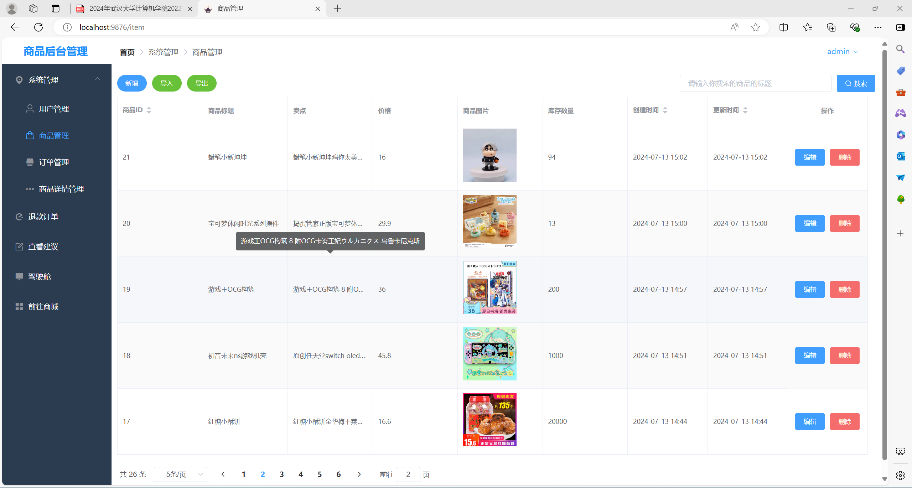

# Vue-Springboot Shopping Mall

### 介绍

这是一个基于Vue和SpringBoot的购物商城，基本覆盖了商家端和卖家端的基本功能。

### B站教程

_商城简介_：https://www.bilibili.com/video/BV1Tz421R7H6

_项目安装教程_：待完善

### 系统预览图

### 软件架构

前端采用了Vue2框架，所以需要提前安装npm

后端采用了SpringBoot框架

### 安装教程

1.  将项目下载到本地，使用idea打开
2.  更新pom依赖文档，下载SpringBoot依赖，确保后端可以运行
3.  **进入vue文件夹**，使用node.js里面的 **npm i** 命令下载Vue相关依赖
4.  MySQL版本5.7，新建名为springboot-vue的数据库，然后导入sql文件

### 使用说明

1.  环境搭好之后使用idea直接运行RunApp启动类,打开后端，端口为9090
2.  进入vue文件夹在命令行输入**npm run sever**打开vue前端
3.  点击命令行弹出的相关链接，就可以进入本项目
4.  默认用户名：admin 密码：123进入